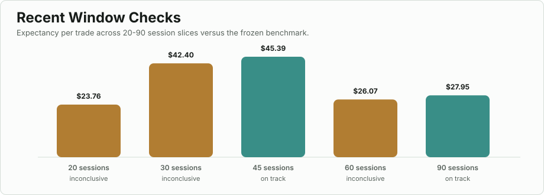
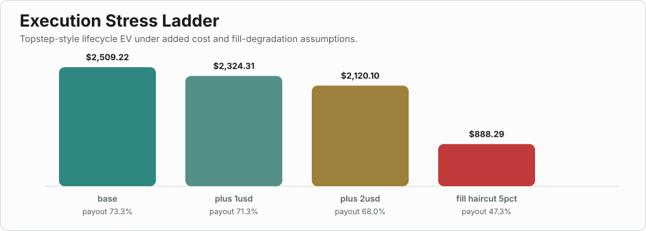
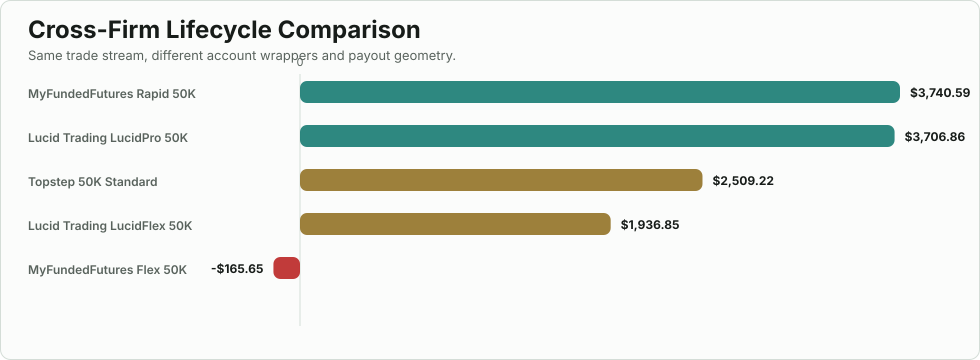

# Quant Research Workbench

Quant Research Workbench is a public-safe quantitative research repo for
empirical trade analysis. It packages a few useful pieces of a larger intraday
futures research stack while keeping private deployable thresholds, venue
bridges, and live execution details out of the public mirror.

The central question is simple:

**Can a modest intraday edge remain meaningful after transaction costs,
account-rule friction, and execution uncertainty are made explicit?**

If you only read one thing, read this README like a project brief:

- the benchmark is frozen first
- recent windows are judged against that benchmark instead of retuned
- policy branches are promoted only after ablation and stress checks
- trade-level edge is kept separate from payout geometry
- the public repo rebuilds its own charts, report, and docs payload from
  checked-in public artifacts

The charts below are generated from the public artifact layer and rebuilt by
`build-public-demo`.

## In one minute

| Topic | Public read |
| --- | --- |
| Benchmark anchor | 1123 broad OOS trades, 66.6% win rate, $23.52 expectancy |
| Recent validation | 164 recent trades, 67.7% win rate, $27.95 expectancy, status `on_track` |
| Best current policy | `exclude_prior_sweep`, the only checked branch with a positive EV lower bound |
| Main production warning | execution quality matters more than cosmetic retuning |
| Public package | CLI for summaries, bootstrap EV, lifecycle Monte Carlo, and static report output |

## Research workflow

```mermaid
flowchart LR
    A[Normalize futures data] --> B[Extract event families and context]
    B --> C[Backtest and summarize the trade stream]
    C --> D[Freeze broad OOS benchmark]
    D --> E[Check recent windows against the benchmark]
    E --> F[Run policy ablations]
    F --> G[Wrap the same trade stream in account rules]
    G --> H[Stress costs and fill quality]
    H --> I[Publish public-safe artifacts and reports]
```



The public code mirrors the evaluation side of that workflow, while the private
live execution bridge remains out of scope.

## Key public findings

### 1. Recent windows are judged against a frozen benchmark

<p>
  
</p>

- 45-session and 90-session windows stayed `on_track`
- the 90-session check landed at **164 trades**, **$27.95 expectancy**, and a
  **+$0.28 EV lower bound**
- the point is not that every recent slice looked good; it is that recency is
  being judged against a locked anchor instead of becoming a retuning excuse

Sources:
[benchmark_summary.json](results/reference/benchmark_summary.json),
[window_checks.csv](results/reference/window_checks.csv)

### 2. Execution quality is the first thing that breaks

<p>
  
</p>

- small extra cost stress still leaves the lifecycle EV positive
- a broad **5% fill haircut** cuts lifecycle EV from **$2,509.22** to
  **$888.29**
- that makes execution quality a first-order research variable, not a cleanup
  detail for later

Source:
[stress_scenarios.csv](results/reference/stress_scenarios.csv)

### 3. Account geometry materially reshapes the same trade stream

<p>
  
</p>

- the same underlying trade stream looks very different across account wrappers
- **MyFundedFutures Rapid 50K** and **LucidPro 50K** lead the checked base case
- **MyFundedFutures Flex 50K** is negative on the same stream

Source:
[firm_comparison.csv](results/reference/firm_comparison.csv)

### 4. Only one checked policy branch kept a positive lower bound

| Policy | EV lower | Status | Lifecycle EV |
| --- | ---: | --- | ---: |
| `baseline` | -$2.23 | inconclusive | $2,498.32 |
| `volatile_only` | -$4.25 | inconclusive | $3,631.01 |
| `exclude_prior_sweep` | +$0.28 | on_track | $2,491.84 |

That result is a better reason to promote a branch than "it looked best in the
last sample."

Source:
[policy_ablations.csv](results/reference/policy_ablations.csv)

## What is public here, and what is not

| Included in the public mirror | Kept private |
| --- | --- |
| frozen benchmark summary metrics | raw minute data and venue adapters |
| recent-window validation artifacts | private ranked-event score thresholds |
| policy and cost ablation tables | optimizer internals |
| anonymized trade export preserving empirical pnl | live execution bridges and account credentials |
| runnable package for summaries and lifecycle sim | turnkey live trading code |

That split is intentional. The public repo is meant to be auditable and useful
without publishing the deployable edge.

## Run the public workbench

```bash
python3 -m pip install -e .
python3 -m quant_workbench.cli build-public-demo --repo-root . --iterations 2000 --seed 7
python3 -m quant_workbench.cli summarize-trades --trades examples/anonymized_oos_trades.csv
python3 -m quant_workbench.cli summarize-regimes --trades examples/anonymized_oos_trades.csv
python3 -m quant_workbench.cli bootstrap-ev --trades examples/anonymized_oos_trades.csv --iterations 2000 --seed 7
python3 -m quant_workbench.cli simulate-lifecycle --trades examples/anonymized_oos_trades.csv --iterations 2000 --seed 7
python3 -m quant_workbench.cli write-report --trades examples/anonymized_oos_trades.csv --out examples/anonymized_oos_report.html --iterations 2000 --seed 7
```

`build-public-demo` regenerates:

- [examples/anonymized_oos_report.html](examples/anonymized_oos_report.html)
- [docs/data/site_data.json](docs/data/site_data.json)
- [results/generated/package_summary.json](results/generated/package_summary.json)
- [results/generated/package_regimes.json](results/generated/package_regimes.json)
- [results/generated/package_bootstrap_ev.json](results/generated/package_bootstrap_ev.json)
- [results/generated/package_lifecycle.json](results/generated/package_lifecycle.json)
- [results/generated/artifact_manifest.json](results/generated/artifact_manifest.json)
- `assets/readme/*.svg`

## What the package is good for

- reviewing an empirical trade export without opening a notebook stack
- comparing regime buckets and EV uncertainty quickly
- teaching the difference between trade-level edge and lifecycle economics
- showing research discipline and limitations in a recruiter-safe repo

## Where to dig deeper

- [docs/index.html](docs/index.html)
  Static project overview and artifact browser.

- [CASE_STUDY.md](CASE_STUDY.md)
  Full narrative of benchmark freezing, ablations, stress, and limitations.

- [ARCHITECTURE.md](ARCHITECTURE.md)
  Public architecture and boundary between research and deployment.

- [WORKFLOW.md](WORKFLOW.md)
  End-to-end research workflow from normalized data to artifact publication.

- [USER_GUIDE.md](USER_GUIDE.md)
  CLI usage and rebuild flow.

- [results/README.md](results/README.md)
  Difference between `results/reference` and `results/generated`.

- [examples/anonymized_oos_trades.csv](examples/anonymized_oos_trades.csv)
  Checked-in public example input.

## GitHub Pages

The `docs/` folder is already structured for GitHub Pages. The page reads from
`docs/data/site_data.json`, which is regenerated by `build-public-demo`.
